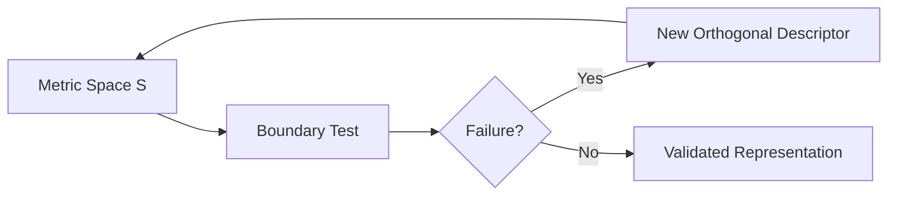

# Structural Complexity Mapping: Boundaries and Failure Regimes

## Abstract
The Boundary Validation Protocol (BVP) posits that complexity measures must be evaluated against structural edge cases rather than correlated with subjective intuition. This paper introduces the Information-Theoretic Causal Complexity Space (ICCS), a multi-dimensional representation of geometric, temporal, and causal structures. We transition from theory to empirical validation by mapping the operational boundaries and failure regimes of ICCS under observational noise.

## 1. The BVP Protocol Pipeline

The BVP framework operates on a systematic falsification loop:

## 2. Differential Degradation (Results)

The ICCS feature space demonstrates non-redundant structural failure modes under observational noise boundaries. 
- **Geometry ($D_{local}$)** remained robust, serving as a stable topological invariant under moderate noise.
- **Predictive Memory ($M$)** degraded smoothly and monotonically.
- **Causal Fingerprint ($TE$)** exhibited sharp, system-specific failure regimes.

### The Lorenz Insight
A critical discovery was the immediate collapse of directed information transfer ($TE$) in the deterministic Lorenz system under minimal noise ($5\%$). The reduction of TE in Lorenz under noise does not indicate a loss of structural complexity. Instead, it reveals that predictive memory and geometric organization can persist independently from detectable directed information transfer. This confirms that these axes capture distinct epistemic properties of the underlying dynamics.

## 3. Boundary Preservation

The central validation of the ICCS feature space is its ability to distinguish a true causal system ($X \rightarrow Y$) from a predictive mimic with identical predictive mutual information. 

As tested up to 20% relative Gaussian noise, the absolute metrics degraded, but the **Relative Causal Gap** ($\approx 0.90 - 1.00$) remained fully preserved. The structural causal boundary remains separated under observational noise, confirming that relational boundary preservation holds far beyond the point where absolute metric magnitudes fail.

Furthermore, testing hyperparameter stability across $k \in \{5, 10, 20, 50\}$ demonstrated qualitative stability of structural ordering ($TE_{causal} > TE_{mimic}$ universally).

## 4. Scalar Collapse Revalidation (Experiment 5)

We investigated whether scalar projections of the feature space preserve the structural separability required by BVP. Testing projections like the $L_2$ norm ($f_1 = ||S||_2$) and algebraic sum ($f_2 = \sum S_i$), we found that while numerical gaps existed, they were driven by massive, non-causal components (e.g., $M(k)$ in the mimic system overwhelming the $TE$ in the causal system). 

The naive scalar metric ranked the predictive mimic as "more complex" than the truly causal system simply due to its higher autoregressive memory. This empirical result definitively demonstrates why structural complexity cannot be reduced to a scalar without losing essential causal and geometric distinctions.
