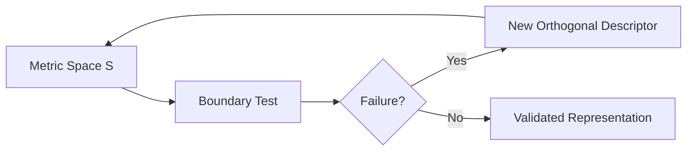
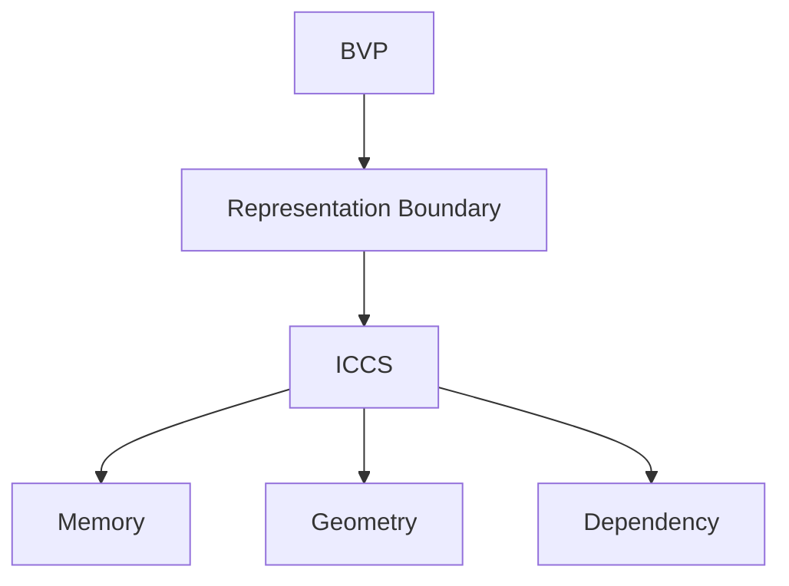

# Structural Complexity Mapping: Boundaries and Failure Regimes

## Abstract
The Boundary Validation Protocol (BVP) posits that complexity measures must be evaluated against structural edge cases rather than correlated with subjective intuition. This paper introduces the Information-Theoretic Structural Complexity Space (ICCS), a multi-dimensional representation of geometric, temporal, and dependency structures. We transition from theory to empirical validation by mapping the operational boundaries and sensitivity regimes of ICCS under observational noise, validated on synthetic systems and multivariate sensor trajectories.

## Contributions
- proposes Boundary Validation Protocol (BVP) for evaluating representation sensitivity
- introduces ICCS as a multidimensional structural profile
- demonstrates boundary-dependent behavior across synthetic and real-world multivariate trajectories
- compares ICCS against scalar and low-dimensional baselines

## 1. The BVP Protocol Pipeline

The BVP framework operates on a systematic falsification loop:

## 2. Differential Degradation (Results)

The ICCS feature space demonstrates non-redundant structural failure modes under observational noise boundaries. 
- **Geometry ($D_{local}$)** remained comparatively stable, suggesting robustness of the estimated local geometric structure under moderate noise.
- **Predictive Memory ($M$)** degraded smoothly and monotonically.
- **Dependency Signature ($TE$)** exhibited sharp, system-specific sensitivity regimes.

### The Lorenz Insight
A critical discovery was the rapid reduction of directed information transfer ($TE$) in the deterministic Lorenz system under minimal noise ($5\%$). The reduction of TE in Lorenz under noise does not indicate a loss of structural complexity. Instead, it reveals that predictive memory and geometric organization can persist independently from detectable directed information transfer. This provides evidence that these axes measure distinct aspects of the observed dynamics.

## 3. Boundary Preservation

The central validation of the ICCS feature space is its ability to distinguish a directed dependency system ($X \rightarrow Y$) from a predictive mimic with identical predictive mutual information. 

As tested up to 20% relative Gaussian noise, the absolute metrics degraded, but the **Relative Dependency Gap** ($\approx 0.90 - 1.00$) remained fully preserved. The structural boundary remains separated under observational noise, indicating that relational separation can remain detectable after substantial attenuation of absolute metric values.

Furthermore, testing hyperparameter stability across $k \in \{5, 10, 20, 50\}$ demonstrated qualitative stability of structural ordering ($TE_{directed} > TE_{mimic}$ universally).

## 4. Scalar Collapse Revalidation (Experiment 5)

We investigated whether scalar projections of the feature space preserve the structural separability required by BVP. Testing projections like the $L_2$ norm ($f_1 = ||S||_2$) and algebraic sum ($f_2 = \sum S_i$), we found that while numerical gaps existed, they were driven by large non-dependency components (e.g., $M(k)$ in the mimic system overwhelming the $TE$ in the directed system). 

The naive scalar metric ranked the predictive mimic as "more complex" than the reference directed-dependency system simply due to its higher autoregressive memory. This empirical result demonstrates that the tested scalar projections do not preserve the structural distinctions validated by the BVP suite.

## 5. Empirical Validation on Multivariate Sensor Trajectories

### 5.1 Dataset and Evaluation Protocol

To transition from synthetic bounds to real-world operational stress, we validated the ICCS representation against the NASA C-MAPSS turbofan degradation dataset (FD001). A data-driven baseline was established via variance filtering and Spearman dependency clustering, yielding a fixed representation ($X=s9, Y=s4, Z=s3$) independent of RUL labels.

| Experiment | Boundary | Stressor | Evaluated effect |
|---|---|---|---|
| Temporal | lifetime | degradation | component separation |
| Representation | compression | transformations | structural information loss |
| Noise | observation | Gaussian perturbation | robustness profile |

### 5.2 Temporal Boundary Evaluation
When mapping ICCS profiles across normalized Early, Middle, and Late degradation phases, the components separated distinct physical responses. Memory and dependency measures evolved significantly, while local geometric estimates remained decoupled and comparatively stable.

### 5.3 Representation Boundary Evaluation
Testing representational transformations (Rolling features, PCA) demonstrated that representations are not structurally neutral. Smoothing can increase apparent temporal memory, while dimensionality reduction removes explicit multivariate cross-channel representation.

### 5.4 Noise Robustness Evaluation
Under additive relative Gaussian noise (up to 20%), different ICCS components exhibited distinct sensitivity profiles. Local geometric estimates remained comparatively stable, while memory predictably attenuated, maintaining a consistently detectable boundary between healthy and degraded states.

## 6. Validation Framework: Boundary-Based Representation Evaluation

The validation suite evaluates whether different representations preserve distinguishable structural properties under controlled boundary conditions.

| Boundary       | Stress factor              | Question                                               | Evaluated component      |
| -------------- | -------------------------- | ------------------------------------------------------ | ------------------------ |
| Temporal       | degradation progression    | How does structure evolve?                             | M, D_local, TE, CMI      |
| Representation | compression/transformation | What information is altered?                           | structural preservation  |
| Noise          | observation perturbation   | What survives measurement degradation?                 | robustness               |
| Baseline       | representation choice      | What structural aspects are not explicitly represented?| sensitivity profile      |

## Limitations

- Validation was performed on FD001 with a single operating condition.
- Channel selection was evaluated under a fixed baseline protocol.
- TE and CMI are interpreted as dependency estimates rather than physical causality.
- Results characterize structural signatures, not optimal prediction performance.
- The baseline comparison evaluates structural sensitivity rather than predictive accuracy on remaining useful life estimation.
